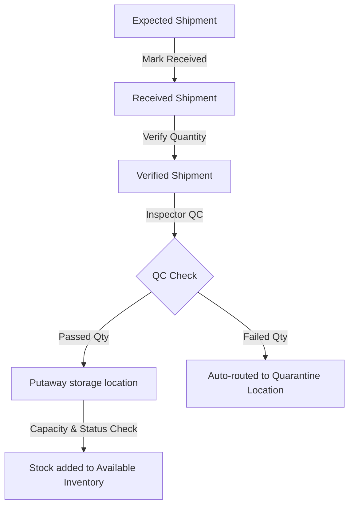
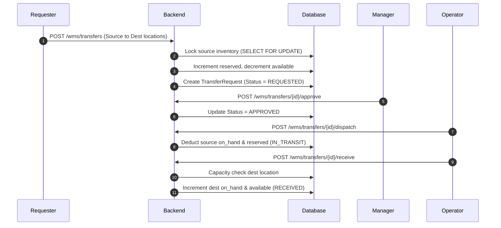

# docs/CORE_WAREHOUSE_WORKFLOW.md — Core Warehouse Workflows

This document details the operational workflows for the core warehouse activities.

---

## 1. Quality Control & Putaway Workflow

---

## 2. Inventory Transfers Request Flow

