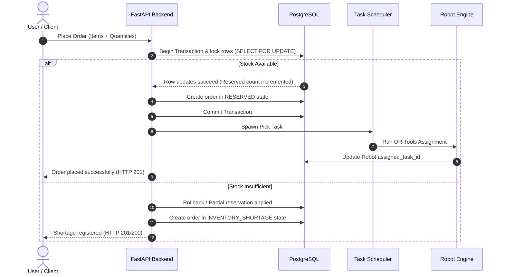

# docs/FINAL_PROJECT_WORKFLOW.md — End-to-End Business Workflows

This document outlines the core business operations workflows.

---

## 1. WMS Order Processing Workflow

---

## 2. Inventory Receiving & Putaway Workflow
1. **ASN Registration**: Supplier submits an Advanced Shipping Notice. An expected shipment quantity is registered in PostgreSQL.
2. **Quality Control Check**: Inspector runs verification checks against received quantities. Discrepancies are logged in the movement ledgers.
3. **Location Allocation**: Backend selects the optimal storage rack based on zoning heuristics.
4. **Transaction Putaway**: Inventory quantities are shifted from receiving zones to storage racks. An entry is appended to `InventoryMovementLedger`.
