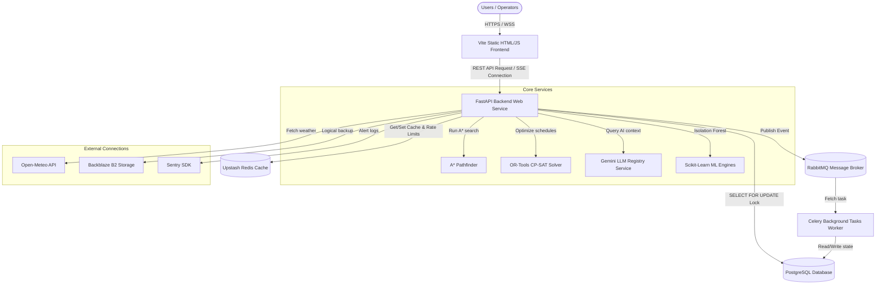

# docs/FINAL_SYSTEM_ARCHITECTURE.md — System Architecture Description

This document describes the final production architecture topology and dataflow layers.

---

## 1. System Topology

---

## 2. Component Descriptions

### Source of Truth
- **PostgreSQL**: Stores relational models (Users, Warehouses, Items, Inventory, Orders, Tasks, Robots, AccessLogs). Uses row-locking transactions to maintain ACID safety.

### Messaging & Scheduling
- **RabbitMQ / Celery**: Decouples async workflows (order status logs, backups, analytics triggers).
- **Redis**: Rate limiter, transient caches, session tokens.

### Visualization & Sync
- **Server-Sent Events (SSE)**: Streams increment coordinates updates from the robot queue simulator directly to the Three.js dashboard canvas.
