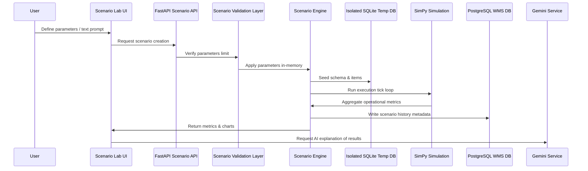

# Phase 15 Scenario Lab Architecture

This document maps the implementation details of the scenario orchestration layers.

## 1. Sequence & Data Flow

## 2. Sandbox DB Isolation
- A temp SQLite database file is created at runtime inside system temp directory:
  `sqlite:///{db_path}`
- Operational schema is migrated dynamically onto the temp database.
- After simulation completion, the temp database session is closed, the connection pool disposed, and the SQLite file deleted.
- Live WMS database tables (orders, tasks, robots) are strictly read-only and never mutated.
