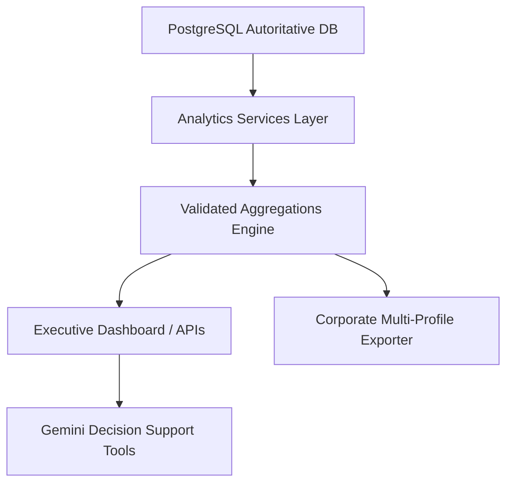

# Phase 16 Analytics Architecture

This document describes the flow and organization of the WMS analytics calculation systems.

## 1. Flow of Data

## 2. Dynamic Report Routing Engine
- The reports framework in [`backend/reports.py`](file:///c:/Users/harsh/Downloads/warehouse_project_v3/warehouse_v3/backend/reports.py) uses a unified dictionary interface (`get_report_data_by_type`).
- Based on `report_type`, it dynamically queries the corresponding SQL tables (e.g. `shrinkage_flags`, `inventory`, `replenishment_recommendations`), maps headers, and compiles PDF, Excel, and CSV binaries using memory streams (`io.BytesIO`).
