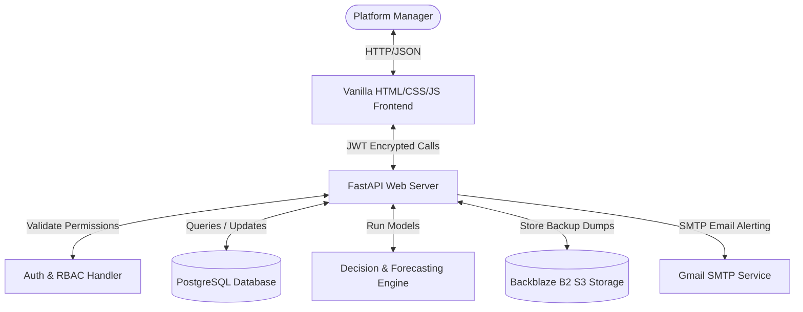

# Smart Warehouse Platform — Final System Architecture

This document describes the high-level architecture, components, and data flow sequences of the Smart Warehouse platform.

---

## 1. System Overview



---

## 2. Core Workflows

### Reorder Approval Workflow
```
[平台管理员]
  ↓ Login & View Low Stock
[Dashboard]
  ↓ Navigate to AI Decision Center
[AI Decision Center] (Loads forecasts and safety stock levels)
  ↓ Approve Reorder Recommendation
[Audit Log] (Appends action entry with hash-chain verification)
  ↓ Commit to Database
[PostgreSQL] (Stock transaction updated)
```

### Anomaly / Shrinkage Scanner
```
[Database]
  ↓ Query Inventory stock movements
[ML Model] (Runs IsolationForest & KMeans clustering)
  ↓ Computes estimated discrepancies & costs at risk
[Shrinkage Dashboard] (Flags "Requires Investigation")
  ↓ Manager triggers audit log update
[PostgreSQL]
```

### Stock Transfer Advisor
```
[PostgreSQL] (Queries surplus vs deficit warehouses)
  ↓ Computes shipping vs procurement costs
[Transfer Advisor UI] (Displays estimated savings)
  ↓ Manager action
[PostgreSQL]
```

---

## 3. Cryptographic Tamper-Evident Audit Ledger

The audit ledger implements a hash-chaining verification scheme to guarantee block integrity:

```
[Entry N-1]
  ├── event_type: "stock_out"
  ├── details: {"item_id": "CPU-INTEL-I9", "qty": 10}
  └── hash: "prev_sha256_hash_here..."
       ↓
[Entry N]
  ├── event_type: "warehouse_created"
  ├── details: {"warehouse_id": "WH-BLR-01"}
  ├── prev_hash: "prev_sha256_hash_here..."
  └── hash: SHA-256(Entry N fields + Entry N-1 hash)
```

Running `/apps/trust-ledger` validates the chain sequentially. Any altered row breaks the downstream hashes and is identified immediately.
