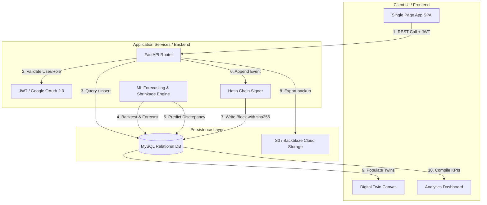

# FINAL_SYSTEM_ARCHITECTURE.md — Smart Warehouse Intelligence Platform

This document describes the high-level system architecture and data flows of the Smart Warehouse platform.

---

## 1. High-Level System Architecture

The data flows from operational transaction entries through analytics engines, human reviews, and security ledgers:

---

## 2. Core Components and Data Classifications

Every metric, log, or telemetry element in the application is strictly classified into one of the following categories to support transparency and academic rigor:

### A. Operational Data (MySQL Database — Truth Source)
- **Source**: `stock_movements`, `warehouses`, `items`, `users` tables.
- **Attributes**: Real-world operations like manual stock recordings, item registration, and user profiles.
- **Access**: Restricted using server-side FastAPI Depends.

### B. Machine Learning (ML) Outputs (Statistical Models)
- **Demand Forecast**: 14-day chronological prediction from historical inventory entries. Sourced via `ml/forecast.py`.
- **WAPE Metric**: Holdout error percentage calculated by retrospectively simulating model performance on the last 25% of data.
- **Shrinkage Anomaly flags**: Computed via IsolationForest outlier detection in `ml/shrinkage_detector.py`.

### C. Simulated Data (Labeled "SIMULATED")
- **Environmental Racks Temperature**: Displayed on the digital twin rack layout to simulate environmental control feeds.
- **Humidity & Sensor states**: Synthetic constants rendered dynamically in the digital twin view. No physical hardware nodes exist.

### D. Calculated Metrics (Programmatic Formulations)
- **Inventory Value**: Programmatically computed as `SUM(closing_stock × unit_cost)`.
- **Warehouse Utilization**: `total_occupied / total_capacity_limit (500 per warehouse) × 100`.
- **Ledger verification**: The linear verification of `prev_hash == hash` across the database table.

### E. Human Decisions (Human-In-The-Loop)
- **Approvals & Rejections**: Manager decisions logged on the `ai_recommendations` table, which directly update operational stock tables when approved.
- **Audit Logs**: Access log records tracking administrative logins, new user creations, and verification actions.

---

## 3. Data Flow Scenario: AI Recommendation to Trust Ledger

The following flow trace outlines what happens when a shrinkage alert is investigated and approved:

1. **Detection**: The IsolationForest runs (`/run-shrinkage-detection`) and flags a stock discrepancy.
2. **Recommendation**: An explainable warning is written to the `ai_recommendations` table (Risk: HIGH, Status: PENDING).
3. **Manager Review**: A manager views the alert in the AI Decision Center, reviews the input factors, and clicks **Approve**.
4. **Operation**: FastAPI receives the request, writes a stock correction entry to `stock_movements`, and updates the recommendation status to `APPROVED`.
5. **Ledger Signature**: The backend calls the `audit_ledger.append_entry()` method. It loads the previous ledger row's hash, compiles the new entry payload, hashes the combination using SHA-256, and inserts the signed block into the `audit_ledger` table.
6. **Immutable Sync**: Any offline SQL alteration of the logged event payload breaks the hash chain, causing `/audit/verify` to fail.
