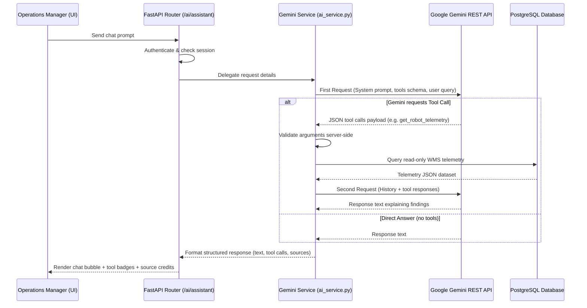

# Phase 14 AI Assistant Architecture

This document details the software architecture, flow patterns, and integration boundaries of the WMS Intelligent Diagnostics assistant.

## 1. Flow Diagram

## 2. Centralized Model Orchestration
- **Service Layer**: Managed in [`backend/services/ai_service.py`](file:///c:/Users/harsh/Downloads/warehouse_project_v3/warehouse_v3/backend/services/ai_service.py).
- **Graceful Fallback**: If the API key is not configured, the service routes requests to the local rule-based helper (`offline_assistant_reply`), preventing crashes and ensuring high system availability.
