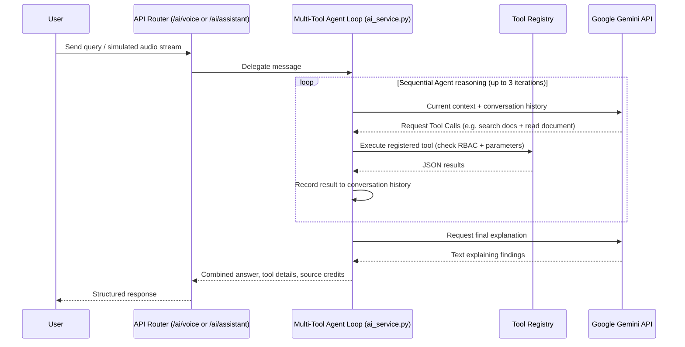

# Phase 14 Optional AI Architecture

This document registers the architecture of the **Google Gemini Optional Capabilities** extension.

## 1. Sequence & Event Flow

## 2. Integrated Optional Capabilities
- **Thinking / Reasoning**: Instructs Gemini to perform step-by-step reasoning over JSON WMS datasets, verifying metrics before writing text output.
- **Multi-tool Reasoning**: Evaluates sequential dependencies (e.g., getting warehouse anomalies, then checking manuals for safety SOP rules).
- **File Search / RAG**: Simple local document scanning inside the `docs/` folder, separating document truths from PostgreSQL state databases.
- **Document Understanding**: Read tools returning previews of warehouse SOP files.
- **Sandbox Code Execution**: Restricts evaluation to mathematical operations, blocking imports, FS commands, and database logins.
- **Google Search Grounding**: Integrates industry automation research context.
- **Google Maps Grounding**: Integrates logistics coordinates facilities mapping.
- **Voice AI API**: Adds `/ai/voice` route to process voice base64 streams.
