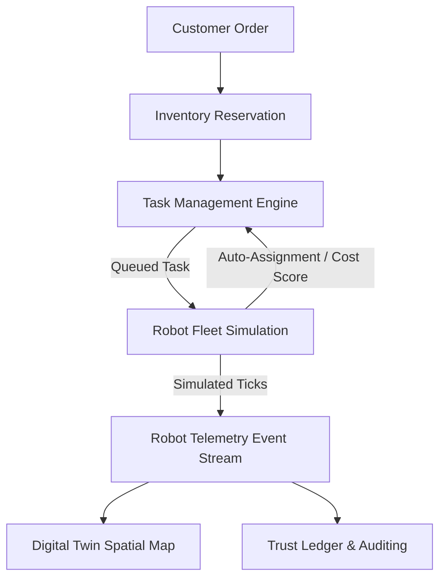
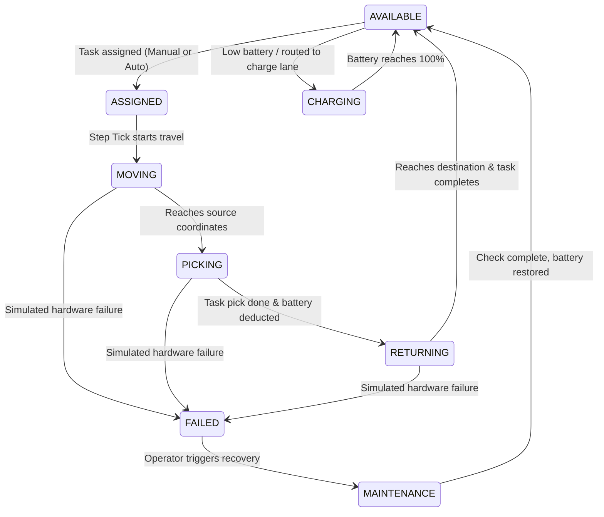

# Phase 5 Report: Robot Fleet Simulation & Control

## 1. Executive Summary
This report summarizes the design, implementation, and verification of **Phase 5: Robot Fleet Simulation & Control** for WAREHOUSE OS. The system implements a realistic, deterministic simulation of autonomous mobile robots (AGVs/AMRs) executing pick-and-place tasks inside a digital twin environment. It includes a rule-based assignment engine, battery consumption/charging models, simulated hardware failure injection, and front-end control desk interfaces.

---

## 2. Architecture & Data Flow Diagram

---

## 3. Robot Model & Table Schema
The `Robot` and `RobotTelemetryEvent` models are persisted in PostgreSQL via Alembic migration (`dbf8748ff321_add_robot_fleet_tables`).

### Robot Table (`robots`)
* `id` (Integer, Primary Key)
* `robot_code` (String(30), Unique Index) — e.g. `ROB-001`
* `name` (String(100))
* `warehouse_id` (String(20), ForeignKey to warehouses)
* `status` (String(30)) — IDLE, AVAILABLE, ASSIGNED, MOVING, PICKING, RETURNING, CHARGING, PAUSED, OFFLINE, FAILED, MAINTENANCE
* `battery_level` (Float) — ranges [0.0 - 100.0]
* `current_x`, `current_y` (Float) — current coordinates in the digital twin
* `target_x`, `target_y` (Float) — target coordinates to navigate to
* `assigned_task_id` (Integer, ForeignKey to tasks)

### Robot Telemetry Table (`robot_telemetry`)
* `id` (Integer, Primary Key)
* `robot_id` (Integer, ForeignKey to robots)
* `event_type` (String(50)) — `POSITION_UPDATED`, `BATTERY_UPDATED`, `STATUS_CHANGED`, `TASK_STARTED`, `TASK_COMPLETED`, `FAILURE`, `CHARGING_STARTED`, `CHARGING_COMPLETED`
* `timestamp` (DateTime)
* `x`, `y`, `battery` (Float)

---

## 4. Robot Status Machine

---

## 5. Battery Simulation Model
* **Movement Consumption**: `0.5%` per unit Manhattan distance traveled.
* **Task Consumption**: `5.0%` flat rate per pickup operation.
* **Charging Rate**: `15.0%` increase per simulation step.
* **Low Battery Threshold**: `< 25.0%` — ineligible for new non-critical tasks.
* **Critical Battery Threshold**: `< 10.0%` — stops accepting all work, must charge immediately.

---

## 6. Intelligent Rule-Based Assignment Engine
Automatic dispatch calculates the **Robot Assignment Score** for all enabled, idle, and healthy robots:
$$\text{Assignment Cost} = \text{Manhattan Distance} + \text{Battery Penalty}$$
* **Manhattan Distance**: $|x_2 - x_1| + |y_2 - y_1|$ from the robot's current coordinates to the task's source location coordinates.
* **Battery Penalty**: $50.0$ if the robot's battery is below $30.0\%$.

The robot with the lowest cost is chosen. Every auto-assignment includes an explainability reason listing candidate costs and rejection reasons.

---

## 7. Failure Simulation & Reassignment Recovery
* Triggering `/robots/{id}/simulate-failure` transitions the robot to `FAILED` status.
* If executing a task, the task is automatically transitioned back to `FAILED`/reassignable.
* Audit ledger entry `ROBOT_FAILURE_SIMULATED` is created.
* Operators can manually select another eligible robot or click **Auto-Assign** to pick the next best available candidate.
* The inventory is reserved and deducted exactly once upon completion by the taking-over robot, preventing duplicate deduction anomalies.

---

## 8. Verification Results
Automated test suites pass cleanly:
* `tests/test_robots.py`: 5 passed.
* `tests/test_simulation_e2e.py`: 2 passed (includes E2E task-robot execution flow and E2E failure-reassignment recovery flow).
* All 122 repository regression tests passed cleanly.

---

## 9. Final Verdict
**READY FOR PHASE 6**
