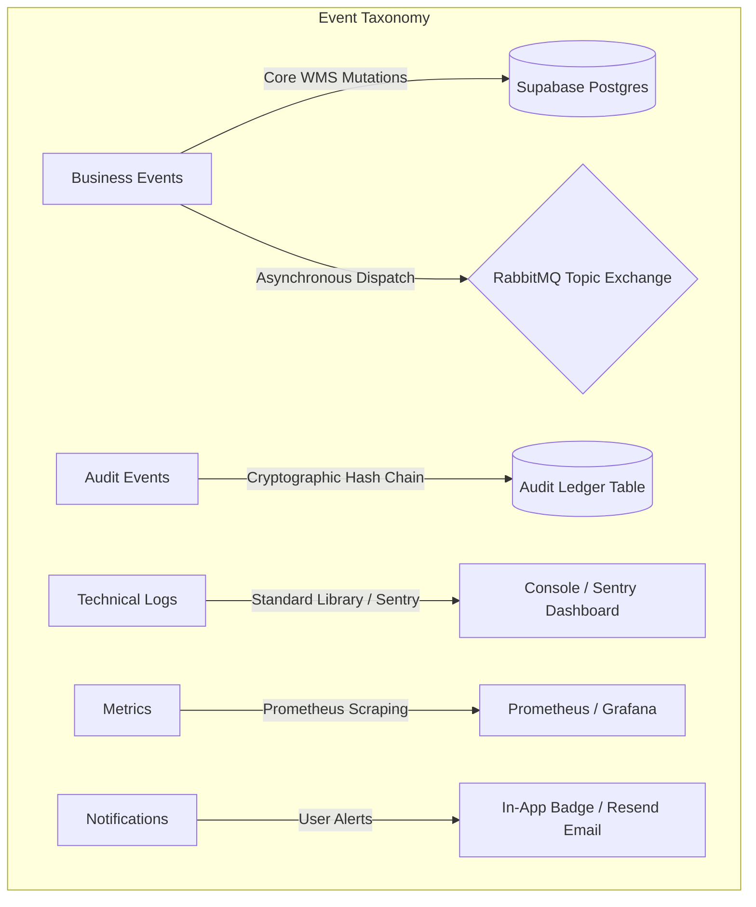

# Unified Event & Observability Architecture

This document maps out the system architecture boundaries and event classifications for the Warehouse OS platform.

---

## 1. Unified Event Taxonomy

We separate and define five distinct categories of events to prevent duplication and mixing of concerns.

### A. Business Events
- **Definition**: Represents changes in the state of WMS entities (Orders, Inventory, Tasks, Robots).
- **Subsystem**: FastAPI Backend & services.
- **Transport**: Centralized `publish_event()` propagates messages to PostgreSQL and RabbitMQ exchange `warehouse_events`.
- **Examples**: `ORDER_CREATED`, `INVENTORY_CHANGED`, `TASK_COMPLETED`, `ROBOT_FAILED`.

### B. Audit Events
- **Definition**: Tamper-evident records tracking user identity and mutation details for security governance.
- **Subsystem**: Audit Ledger database table.
- **Integrity**: Every entry contains `prev_hash` and `hash` fields, forming a SHA-256 cryptographic chain.
- **Examples**: `USER_LOGIN`, `PASSWORD_CHANGED`, `auto_cloud_backup`.

### C. Technical Logs
- **Definition**: Raw text outputs recording errors, warnings, stack traces, and debug info.
- **Subsystem**: Python `logging` module and Sentry SDK.
- **Examples**: Database connection exceptions, API compilation errors, background worker pings.

### D. Metrics
- **Definition**: Numeric time-series values aggregated to measure overall infrastructure performance.
- **Subsystem**: Prometheus client library scraped at `/metrics` by Prometheus/Grafana.
- **Examples**: HTTP request count, p95 request latency, active database pool size, robot utilization ratio.

### E. Notifications
- **Definition**: User-facing visual alerts or transactional emails delivering actionable updates.
- **Subsystem**: Notification database table & SMTP / Resend API dispatch.
- **Examples**: In-app notifications, email notifications, SMS alerts via Twilio.

---

## 2. Observability Architecture Boundaries

We maintain a strict separation between technical systems performance monitoring and business metrics dashboards.

| System Aspect | Observability Focus | Dashboard Layer | Primary Users |
| :--- | :--- | :--- | :--- |
| **Technical System Health** | REST API Latency, DB pool exhaustion, Celery workers active, message broker queues, Sentry exceptions | Grafana (Visual panels loaded from config JSON) | DevOps / Site Reliability Engineers (SRE) |
| **Business Operations Metrics** | Inventory fill rates, average order pack duration, robot travel distances, anomalies flagged count | WMS KPI Dashboard (Chart.js inside frontend) | Warehouse Managers / Operations Administrators |
